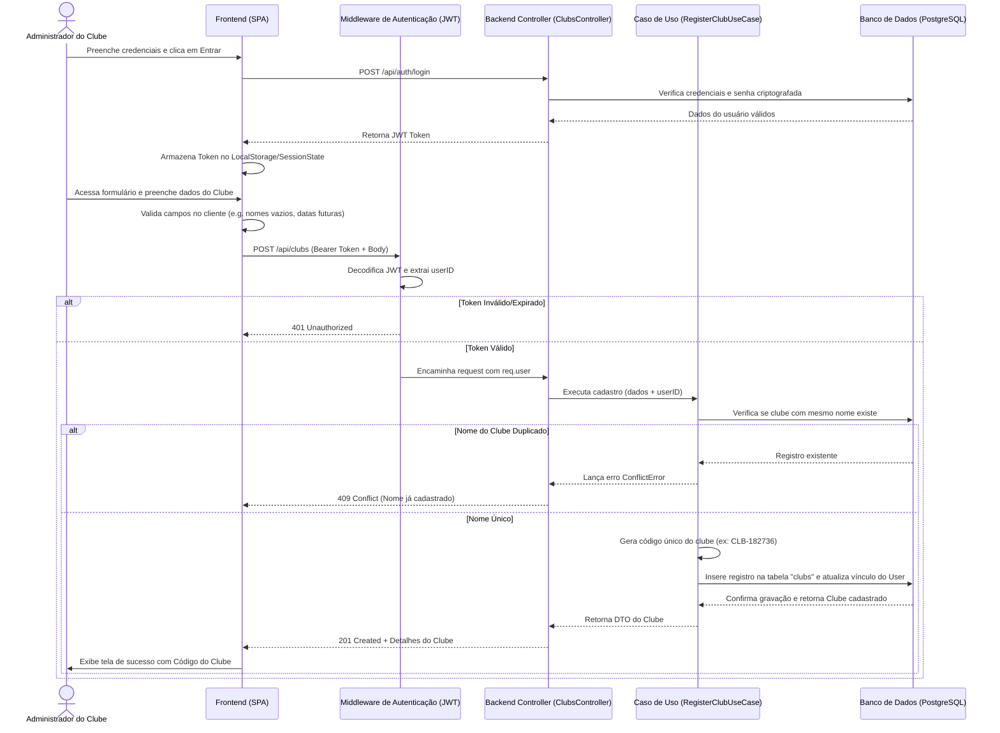

# Documento de Arquitetura e Design Técnico (design.md)

Este documento descreve a arquitetura técnica, modelo de dados e contratos de API para a implementação da funcionalidade de cadastro de Clubes de Desbravadores no sistema **SGC-SDD**.

---

## 1. Visão Geral da Arquitetura

O sistema será estruturado como uma aplicação desacoplada formada por:
1.  **Frontend**: Single Page Application (SPA) construída em **React.js + TypeScript + Vite** utilizando componentes modulares e estilização moderna via CSS Custom Properties (CSS Variables) para um design premium e responsivo.
2.  **Backend**: API RESTful em **Node.js + TypeScript + Express** estruturada sob os princípios de **Clean Architecture** (Separação de Preocupações: Entidades, Casos de Uso, Controladores e Repositórios).
3.  **Banco de Dados**: Relacional **PostgreSQL**, gerenciado via **Prisma ORM** para migrações robustas e type-safety.

### Estrutura de Diretórios Recomendada (Monorepo Simples)
```text
sgc-sdd/
├── apps/
│   ├── api/             # Backend (Node.js + Express + Prisma)
│   │   ├── prisma/      # Schema e Migrações
│   │   └── src/
│   │       ├── domain/  # Entidades de negócio e regras puras
│   │       ├── use-cases/ # Lógica de aplicação (e.g. RegisterClub)
│   │       ├── infra/   # Banco de dados, rotas HTTP, controllers
│   │       └── server.ts
│   └── web/             # Frontend (React + Vite)
│       └── src/
│           ├── components/
│           ├── pages/
│           └── services/ # Clientes de API
├── requirements.md
├── design.md
└── tasks.md
```

---

## 2. Fluxo de Dados (Data Flow Diagram)

O diagrama abaixo ilustra o fluxo de criação de conta do administrador seguido pelo cadastro do clube.



---

## 3. Modelo de Dados (Database Schema)

Usando o dialeto de schema do **Prisma ORM**, modelamos duas entidades principais neste primeiro estágio: `User` (Administrador) e `Club` (Clube de Desbravadores).

```prisma
datasource db {
  provider = "postgresql"
  url      = env("DATABASE_URL")
}

generator client {
  provider = "prisma-client-js"
}

enum Role {
  ADMIN_CLUB
  MEMBER
  INSTRUCTOR
}

model User {
  id           String   @id @default(uuid())
  name         String
  email        String   @unique
  passwordHash String
  role         Role     @default(ADMIN_CLUB)
  createdAt    DateTime @default(now())
  updatedAt    DateTime @updatedAt
  
  // Relacionamento 1:1 - Um administrador gerencia no máximo um clube nesta fase.
  managedClub  Club?    @relation("ClubDirector")
  clubId       String?
}

model Club {
  id           String   @id @default(uuid())
  name         String   @unique
  uniqueCode   String   @unique // Código gerado CLB-XXXXXX
  association  String          // Associação ou Missão regional da IASD
  localChurch  String          // Igreja local vinculada
  city         String
  state        String
  foundingDate DateTime
  createdAt    DateTime @default(now())
  updatedAt    DateTime @updatedAt

  // Diretor do clube (User)
  directorId   String   @unique
  director     User     @relation("ClubDirector", fields: [directorId], references: [id], onDelete: Cascade)
}
```

---

## 4. Contratos de API

### 4.1. Registrar Administrador
*   **Método**: `POST`
*   **Path**: `/api/auth/register`
*   **Headers**: `Content-Type: application/json`
*   **Request Body**:
```json
{
  "name": "Carlos Silva",
  "email": "carlos.silva@email.com",
  "password": "senhaSegura123"
}
```
*   **Responses**:
    *   **201 Created**: Usuário registrado com sucesso.
        ```json
        {
          "id": "a6b9a89d-7f5b-4395-88e2-2a543329f60f",
          "name": "Carlos Silva",
          "email": "carlos.silva@email.com",
          "role": "ADMIN_CLUB"
        }
        ```
    *   **400 Bad Request**: Campos inválidos ou e-mail inválido.
    *   **409 Conflict**: E-mail já em uso.

### 4.2. Login do Administrador
*   **Método**: `POST`
*   **Path**: `/api/auth/login`
*   **Request Body**:
```json
{
  "email": "carlos.silva@email.com",
  "password": "senhaSegura123"
}
```
*   **Responses**:
    *   **200 OK**: Login bem-sucedido. Retorna JWT Token.
        ```json
        {
          "token": "eyJhbGciOiJIUzI1NiIsInR5cCI6IkpXVCJ9.eyJ1c2VySWQiOiJhNmI5YTg5ZC1..."
        }
        ```
    *   **401 Unauthorized**: Credenciais inválidas.

### 4.3. Cadastrar Clube de Desbravadores
*   **Método**: `POST`
*   **Path**: `/api/clubs`
*   **Headers**:
    *   `Content-Type: application/json`
    *   `Authorization: Bearer <JWT_TOKEN>`
*   **Request Body**:
```json
{
  "name": "Clube Pioneiros das Estrelas",
  "association": "Associação Paulista Leste",
  "localChurch": "Igreja Adventista do Sétimo Dia Central de Guarulhos",
  "city": "Guarulhos",
  "state": "SP",
  "foundingDate": "1995-10-12T00:00:00.000Z"
}
```
*   **Responses**:
    *   **201 Created**: Clube registrado com sucesso.
        ```json
        {
          "id": "fb430030-cf2a-4df0-94d3-81c8b368db59",
          "name": "Clube Pioneiros das Estrelas",
          "uniqueCode": "CLB-481920",
          "association": "Associação Paulista Leste",
          "localChurch": "Igreja Adventista do Sétimo Dia Central de Guarulhos",
          "city": "Guarulhos",
          "state": "SP",
          "foundingDate": "1995-10-12T00:00:00.000Z",
          "directorId": "a6b9a89d-7f5b-4395-88e2-2a543329f60f"
        }
        ```
    *   **400 Bad Request**: Campos ausentes, data no futuro ou estado inválido (UF fora do padrão de 2 caracteres).
    *   **401 Unauthorized**: Token JWT ausente ou inválido.
    *   **403 Forbidden**: Usuário logado não tem o papel `ADMIN_CLUB`.
    *   **409 Conflict**: Já existe um clube com este nome registrado no banco.

---

## 5. Padrões de Segurança e Validação

1.  **Validação de Input**: No backend, usaremos a biblioteca **Zod** para validar o payload das requisições e garantir que strings vazias ou datas em formatos inválidos sejam rejeitadas antes de atingirem a lógica de negócio.
2.  **Criptografia de Senha**: Senhas em texto puro nunca serão salvas. O backend usará a biblioteca `bcryptjs` para geração de hash seguro de senhas.
3.  **Proteção de Rotas**: Todas as rotas sob `/api/clubs` usarão um middleware interceptador de JWT. Ele extrairá as claims do token e injetará as informações do usuário logado no objeto `request` do Express.
4.  **Tratamento Centralizado de Erros**: Um middleware global no Express interceptará todas as exceções lançadas nos Casos de Uso (como `ConflictError`, `ValidationError` ou `UnauthorizedError`) e mapeará automaticamente para seus respectivos status HTTP correspondentes.
5.  **Multi-tenancy Físico/Lógico**: A chave primária e o vínculo de `directorId` na tabela de clubes garantem que dados futuros criados por aquele administrador fiquem escopados somente ao `clubId` associado ao usuário.
